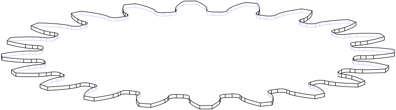

This repository contains two libraries, "OpenCascade-hs" and "Waterfall CAD".

## 

A third party Haskell wrapper to [Open CASCADE](https://dev.opencascade.org) ([wiki](https://en.wikipedia.org/wiki/Open_Cascade_Technology)), which is the underlying framework behind [FreeCAD](https://www.freecad.org/).

Wrapping the Open Cascade API has been done on an incremental basis, and only a partially subset has been extracted, this largely consists of the modeling functionality (BRep/Boolean Ops/Curves/etc), and does not include the visualization components.

## 

Waterfall CAD is a declarative CAD/Solid Modeling library.

This uses [opencascade-hs](https://hackage.haskell.org/package/opencascade-hs) as the kernel, but provides a "more functional" API over it.

## Installing Dependencies

OpenCASCADE-hs depends on Open Cascade version `7.8.x`. In order to run with an earlier version of Open Cascade, you'll need to use a version prior to `0.3.0.0`.

OpenCASCADE-hs is only tested on Debian and MacOS. 

### Linux

As this library depends on OpenCASCADE, I've been developing on Debian with the following packages installed:

```
> sudo apt-get install libocct-data-exchange-7.8 libocct-data-exchange-dev libocct-draw-7.8 libocct-draw-dev libocct-foundation-7.8 libocct-foundation-dev libocct-modeling-algorithms-7.8 libocct-modeling-algorithms-dev libocct-modeling-data-7.8 libocct-modeling-data-dev libocct-ocaf-7.8 libocct-ocaf-dev libocct-visualization-7.8 libocct-visualization-dev occt-misc
```

I think there should be _some_ flexibility as to the exact version of libocct required, and which occt packages are necessary.

### MacOS

On MacOS, you should be able to install [OpenCASCADE](https://formulae.brew.sh/formula/opencascade) via [homebrew](https://brew.sh/):

```
brew install opencascade
```

#### MacOs Intel support:
You'll also need to configure the path to the OpenCASCADE header files, either via `extra-include-dirs`, or `CPATH`:

```
export CPATH=$CPATH:/usr/local/Cellar/opencascade/7.*/include/opencascade/
```

#### MacOs Apple Silicon support:
```
export CPATH=$CPATH:/opt/homebrew/Cellar/opencascade/7.*/include/opencascade/
```

You can add this to your stack.yaml file:
```
extra-include-dirs: 
- /opt/homebrew/Cellar/opencascade/7.8.1_1/include/opencascade
extra-lib-dirs: 
- /opt/homebrew/Cellar/opencascade/7.8.1_1/lib
```

## Licensing

Because OpenCASCADE is licensed under the LGPL version 2.1, I'm also using that library for this project.

## Get in Touch

If you're having any problems using either of these libraries, please feel free to [open an issue](https://github.com/joe-warren/opencascade-hs/issues).

If you've found the project useful, or interesting, or if you've built anything with it, I'd love to hear from you: there's a [Waterfall-CAD Discord server](https://discord.gg/aHfA4XKpyA).

## Examples 

[](waterfall-cad-examples/src/RevolutionExample.hs)
&nbsp;[](waterfall-cad-examples/src/CsgExample.hs)
&nbsp;&nbsp;[](waterfall-cad-examples/src/SweepExample.hs)

[](waterfall-cad-examples/src/GearExample.hs)

[](waterfall-cad-examples/src/OffsetExample.hs)

[](waterfall-cad-examples/src/TextExample.hs)

[](waterfall-cad-examples/src/BoundingBoxExample.hs)

[](waterfall-cad-examples/src/LoftExample.hs)
